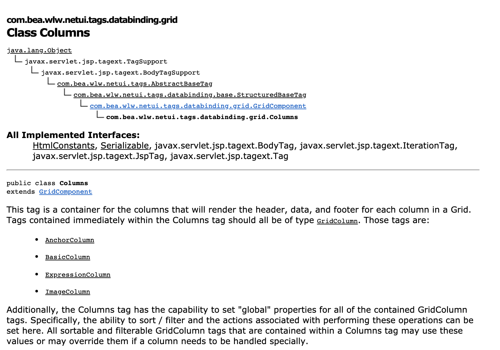
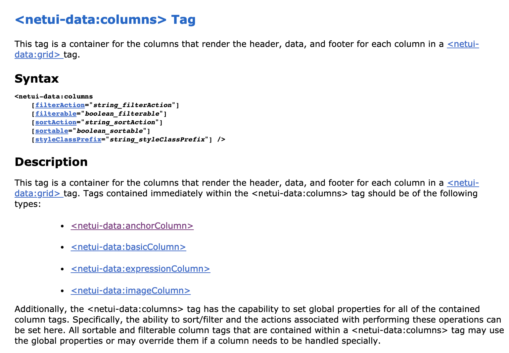

# JspTagDoc doclet

JspTagDoc didn't start out as a sample. It's a tool I wrote while on a team where there was a need to create references for a large number of custom [JavaServer Pages (JSP)](https://en.wikipedia.org/wiki/JavaServer_Pages) tags. JSP tags are a way to encapsulate functionality for use in JSP files. The logic behind a JSP tag is coded in a Java class.

JspTagDoc is a Javadoc doclet designed to generate references for JSP tags and tag attributes, rather than the classes (fields, methods, and inheritance hierachy) beneath the tags.

For example, imagine a `<columns>` JSP tag that renders data from query results. Behind the tag is a Java class `Columns` whose Javadoc comments result in a reference such as the following:



Using the JspTagDoc doclet, you can produce a reference more like the following:



## Doclet Features

In addition to its similarity to standard API-oriented Javadoc output, this doclet does the following:

- Supports content from TLD files, Javadoc comments, and both.
- Supports Javadoc content from standard Javadoc tags, from custom `jsptagref` Javadoc tags, and both.
- Generates XML or HTML output (by transforming XML with [XSLT](xslt/)), or both.
- Creates a uri-list file for linking to external references of the sort generated by this doclet (similar to a package-list file in traditional Javadoc output).

## How the Doclet Works

JspTagDoc combines content from tag library descriptor (TLD) files, which define the elements and attributes for tags, and content collected from tag classes by Javadoc. The doclet merges content from the two sources into a single XML shape, then transforms that XML into HTML output.

1. The doclet's central class is [`JspTagDoc`](src/org/apache/beehive/netui/tools/doclet/jsptagref/JspTagDoc.java). After evaluating command-line options and initializing taglets ([`ConfigurationJspTagDoc`](src/org/apache/beehive/netui/tools/doclet/jsptagref/ConfigurationJspTagDoc.java)), the doclet begins by binding the TLD files to [XMLBeans]() types generated from schema.
2. It then copies information from these types into a new XML shape that is bound to types generated from another schema (TaglibHandler* classes such as [`TagLibHandler11`](src/org/apache/beehive/netui/tools/doclet/jsptagref/TagLibHandler11.java)). This generates one XML document for each JSP tag and function.
3. When information from all of the TLD files has been collected, the doclet uses information in the new XML to locate tag classes and attribute accessor methods from among the classes known to Javadoc.
4. Where supporting classes are found, it copies information collected by Javadoc into the XML that already includes TLD information (using [`JavadocHandler`](src/org/apache/beehive/netui/tools/doclet/jsptagref/JavadocHandler.java)). The doclet adds the completed XML for each JSP tag and function to a summary XML document.
5. Along the way, several utility classes are used to keep track of all the JSP tags known to the current run (these are [`JspTagContext`](src/org/apache/beehive/netui/tools/doclet/jsptagref/JspTagContext.java), [`JspTagDetail`](src/org/apache/beehive/netui/tools/doclet/jsptagref/JspTagDetail.java), and [`Linker`](src/org/apache/beehive/netui/tools/doclet/jsptagref/Linker.java)). These are used to create links and to provide information needed by taglets (in the [`org.apache.beehive.netui.tools.doclet.taglets`](src/org/apache/beehive/netui/tools/doclet/taglets/) package).
6. When the XML has been generated, the doclet optionally transforms it to HTML (using [`JspTagDocTransformer`](src/org/apache/beehive/netui/tools/doclet/jsptagref/JspTagDocTransformer.java)) and [XSLT](xslt/). Again, it generates one file for each tag and function, along with several summary-style files.

## Note About the Schemas

This doclet uses [XMLBeans](https://xmlbeans.apache.org/index.html) types compiled from [schemas](schema/) in order to handle XML. With the exception of the schemas that support version 2.0 tag libraries, these schemas have been created solely for use with the doclet. For example, the schemas that describe version 1.0 and 1.1 libraries were created for use with the doclet (they're not official descriptors of tag library TLD XML). What's more, the schemas are, to date, useful only for generating the XMLBeans types needed by the doclet -- XML generated by the doclet does not necessarily validate against the schemas.

## New Options Supported by this Doclet

`-tldpath path/to/tld/file.tld;path/to/tld/directory`

Specifies a path to TLD files listing tags to document.
This path can be a combination of TLD files and directories (in which
case all TLD files in the directory will be used).

`-xmldir path/to/xml/output/directory`

Specifies the directory to which generated XML should be
written. Omit this option if you don't want XML.

`-contentsource [jsptagref;][tld;][standard]`

Specifies the documentation content sources to use in 
generated docs. The doclet assumes a priority order of 1) "jsptagref" for
the content of `@jsptagref` Javadoc tags; 2) "tld" for content in TLD
files; and 3) "standard" for standard Javadoc documentation content. In 
other words, all three arguments are used, the doclet will look for 1 first;
if it's not found, it will look for 2; if neither 1 or 2 is found, the 
doclet will look for 3. (Note that the order of the arguments is irrelevant.)

`-nolinkconversion`

By default, when generating HTML output the doclet will 
convert links to tag handler classes into links to the generated tag topic.
This option cancels this behavior.
  
`-notaginfo`

Specifies that HTML output should not include "Tag Information"
and "Library Information" sections.

## Standard Javadoc Options *Not* Supported by this Doclet

In some cases, support is omitted because it is irrelevant for JSP tags; in some cases, it simply wasn't implemented.

```
-charset
-docencoding
-docfilessubdirs
-excludedocfilessubdir
-group
-helpfile
-linksource
-nocomment
-nodeprecated
-nodeprecatedlist
-nohelp
-noqualifier
-notree
-serialwarn
-splitindex
-stylesheetfile
-taglet
-tagletpath
-title
-use
-version
```

## Javadoc Tags Introduced by this Doclet

The doclet provides support for several custom Javadoc tags that are designed
to help in authoring JSP-context-specific JSP tag documentation. 

`@jsptagref.tagdescription Text describing the JSP tag.`

- Similar to the description text that precedes a class declaration. The content should be a tag-user-friendly description of  the tag for which the class is a tag handler.
- Location: After the class description Javadoc (if any) preceding the class declaration.

`@jsptagref.attributedescription Text describing the tag attribute.`

- Similar to the description text that precedes an attribute setter method. The content should be a tag-user-friendly description of of the attribute for which the setter method is an accessor.
- Location: After the setter method description (if any) preceding the method code.

`@jsptagref.attributesyntaxvalue concatenatedTextToUseInSyntax.`

- The placeholder value that should appear between the equals signs for the attribute in a syntax block.
- Location: After the setter method description (if any) preceding the method code.

`{@jsptagref.taglink jspTagName@jspTagLibraryUri}`

- An inline tag similar to the @link tag, but for linking to topics such as those generated by this doclet. 
- Location: In the body of a `@jsptagref.tagdescription` tag. Note that this tag should not be used in a standard Javadoc comment unless the user explicitly adds support for it.
 
`@jsptagref.databindable true`

- Used to indicate whether an attribute is databindable in the Beehive netui sense.
- Location: After the setter method description (if any) preceding the method code.

`@jsptagref.see ClassName | URL`

- Similar to the `@see` tag. Used when the link is not relevant or available in the context of standard doclet output.
- Location: The same as the `@see` tag. 

## Conventions Used in the Source

The Java source code uses a variable prefix convention to disambiguate between variables that represent Javadoc types (jvd), generated XML (xml), and TLD XML (tld). Examples include:

- `jvdAttributeType`, for the Javadoc type representing a JSP attribute type (it might be String, int, or some such underneath)
- `xmlAttribute`, for the schema type to which generated XML for an attribute is bound while the doclet is generating XML.
- `tldAttribute`, for the schema type to which TLD XML for an attribute is bound while the doclet is copying TLD info info into new XML.